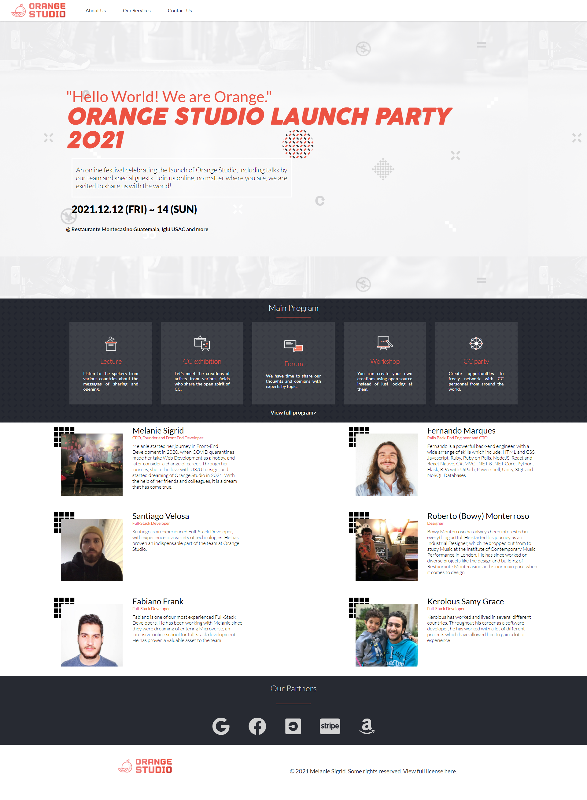

# Orange Studio Webpage

> Capstone project for Microverse. A webpage for a web design studio. Based on the original design by Cindy Shin on [Behance](https://www.behance.net/gallery/29845175/CC-Global-Summit-2015).
> Check project [here](https://melaniesigrid.github.io/OrangeStudio/).
> Video introduction of project [here](https://www.loom.com/share/a3255081058447c8b041fd1f26859241).

## Authors

👤 **Melanie Sigrid**

- GitHub: [@melaniesigrid](https://github.com/melaniesigrid)
- Twitter: [@SiriMoon11](https://twitter.com/SiriMoon11)
- LinkedIn: [LinkedIn](https://www.linkedin.com/in/melanie-arellano-92aaa9194/)

## 🤝 Contributing

Contributions, issues, and feature requests are welcome!

Feel free to check the [issues page](../../issues/).

## Show your support

Give a ⭐️ if you like this project!

## Acknowledgments

- Original design by Cindy Shin on [Behance](https://www.behance.net/gallery/29845175/CC-Global-Summit-2015).

- Hat tip to my reviewers and coding partners at Microverse.

## 📝 License

This project is [MIT](./MIT.md) licensed.
